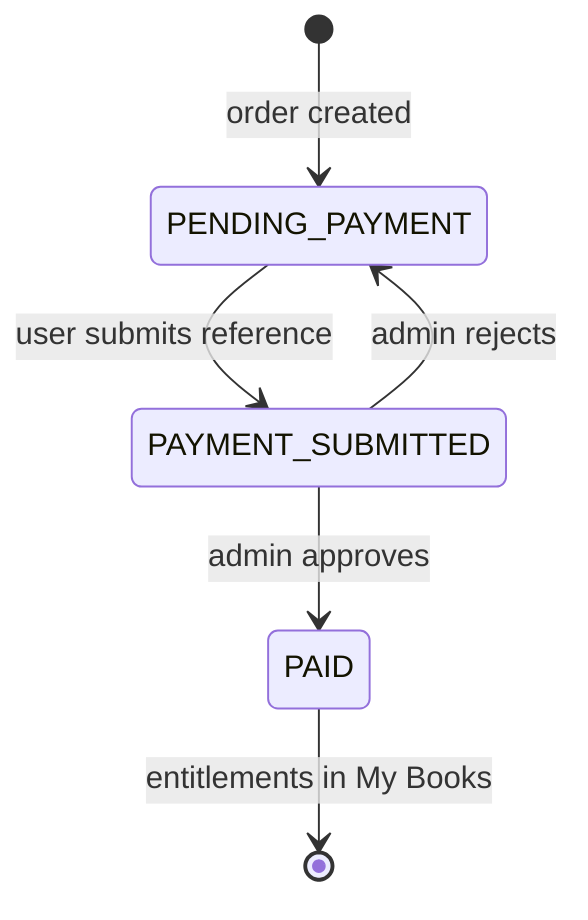

# Book purchase — frontend integration guide

This document is the **user-facing purchase flow** for book editions: browse the store, checkout, pay with reference + service provider (same as course applications), track approval, open **My Books**, and read after payment is approved.

For **store catalog fields**, **admin pricing**, and **course-linked library reading**, see [`BooksFrontend.md`](BooksFrontend.md). Backend specification: [`purchasingBooks.md`](purchasingBooks.md).

---

## Core rule

> **Submitting payment does not grant access.** Only an **admin-approved** payment creates entitlements. Until then, hide “Open book” / reader actions for purchased editions.

---

## Base URL and auth

| Item | Value |
|------|--------|
| API base | Your deployed API origin (e.g. `https://africanhub-api.africanhub.ac.tz`) |
| Path prefix | `/api` |
| Auth | `Authorization: Bearer <user_jwt>` on all endpoints below except public store catalog |
| Content-Type | `application/json` |

### Response envelope

```json
{ "status": "success", "data": { } }
```

```json
{ "status": "error", "message": "Human-readable reason" }
```

---

## Identifiers (do not mix these up)

| Context | Field | Type | Example |
|---------|--------|------|---------|
| Store, cart, checkout, orders | `edition_reference_id` | string (UUID or catalog ref) | `bca85208-74ba-49e1-8c0e-9fa75e9a09de` |
| Order line items | `book_reference_id` | string | LMS book UUID |
| Course-linked reader (separate flow) | numeric LMS `book_id` | number | `6` |

**Paid book reading** uses `edition_reference_id` and `/api/my/paid-editions/.../access`, not `/api/books/{numeric_id}/access`.

---

## End-to-end user journey

```text
Browse store (public)
    → Product page (login)
    → Server price per edition
    → Cart (client state)
    → POST /api/book-orders
    → Payment screen (reuse application payment UI)
    → POST /api/book-orders/{id}/payment
    → Order history / status (PAYMENT_SUBMITTED, pending_payment)
    → [Admin approves]
    → GET /api/my/books
    → POST /api/my/paid-editions/{editionRef}/access
    → Reader (LMS content JWT)
```



---

## 1. Store browse (no login)

Listed editions and **list** prices (not necessarily the logged-in user’s checkout price):

```http
GET /api/store/books
Authorization: Bearer <user_jwt>   ← optional; include on store when user is logged in
```

When the JWT is present, each item adds **`already_purchased`**, **`customer_type`**, and **`your_price`** so cards can show the correct price and hide “Buy” for owned editions.

Optional detail:

```http
GET /api/store/books/{editionReferenceId}
```

**Frontend:** Each row includes LMS presentation fields when the catalog is reachable: `title`, `author`, `cover_url`, `edition_label`, plus nested `book` and `edition`. Use `cover_url` for cards; fall back to your LMS catalog layer only if those fields are `null` (LMS unavailable).

---

## 2. Checkout price (login required)

Never choose new vs previous buyer price in the client. For **each** cart line:

```http
GET /api/store/books/{editionReferenceId}/price
Authorization: Bearer <user_jwt>
```

**Example `200`**

```json
{
  "status": "success",
  "data": {
    "edition_reference_id": "bca85208-74ba-49e1-8c0e-9fa75e9a09de",
    "customer_type": "NEW_BUYER",
    "price": 70000,
    "currency": "TZS"
  }
}
```

`customer_type` is `NEW_BUYER` or `PREVIOUS_BUYER` (user already owns another edition of the same book). Show checkout totals from these `price` values, not from raw list prices on the catalog.

**Optional UX:** Before checkout, you may call `GET /api/my/paid-editions` and disable or remove editions the user already owns (the server also skips them on order create).

---

## 3. Create order

```http
POST /api/book-orders
Authorization: Bearer <user_jwt>
Content-Type: application/json
```

**Request**

```json
{
  "edition_reference_ids": [
    "bca85208-74ba-49e1-8c0e-9fa75e9a09de",
    "another-edition-uuid"
  ]
}
```

Alternate shape (also supported):

```json
{
  "items": [
    { "edition_reference_id": "bca85208-74ba-49e1-8c0e-9fa75e9a09de" }
  ]
}
```

**Example `201`**

```json
{
  "status": "success",
  "data": {
    "id": 42,
    "order_number": "BOOK-ORD-20250930-A1B2C3",
    "status": "PENDING_PAYMENT",
    "total_amount": 115000,
    "currency": "TZS",
    "payment_id": null,
    "payment_reference": null,
    "payment_status": null,
    "items": [
      {
        "book_reference_id": "book-uuid",
        "edition_reference_id": "bca85208-74ba-49e1-8c0e-9fa75e9a09de",
        "quantity": 1,
        "unit_price": 70000,
        "total_price": 70000
      }
    ],
    "skipped_already_owned": ["edition-user-already-has"]
  }
}
```

| Field | UI use |
|-------|--------|
| `id` | Use in payment URL `/api/book-orders/{id}/payment` |
| `order_number` | Show on receipts and payment instructions |
| `status` | `PENDING_PAYMENT` → show payment form |
| `items[].unit_price` | **Lock in UI** — historical order price; do not refresh from catalog |
| `skipped_already_owned` | Inform user those editions were not charged again |

**Errors**

| HTTP | When |
|------|------|
| `409` | User already owns every selected edition |
| `400` / `404` | Invalid or unlisted edition, LMS/price errors |
| `503` | LMS not configured |

---

## 4. Payment (reuse application payment UI)

Book orders use the **same payment pattern as season applications**: pick a **service provider** from the accounting API, enter the **transaction reference**, and provide **mobile number**. **No receipt upload.**

### 4.1 Load payment methods

Use the same endpoint as the course application payment screen:

```http
GET /api/accounting/payment-methods
Authorization: Bearer <user_jwt>
```

**Example fragment**

```json
{
  "status": "success",
  "payment_methods": [
    {
      "id": 2,
      "name": "Bank",
      "code": "bank",
      "instructions": "Pay to account … then enter reference below"
    }
  ]
}
```

Bind dropdown / tiles to `id` → send as `service_provider_id`.

### 4.2 Submit payment for the order

```http
POST /api/book-orders/{orderId}/payment
Authorization: Bearer <user_jwt>
Content-Type: application/json
```

**Request**

```json
{
  "service_provider_id": 2,
  "payment_reference": "OCPA-WBDRJSN4-20250404222213",
  "mobile_number": "255755344162",
  "amount": 115000
}
```

| Field | Required | Notes |
|-------|----------|--------|
| `service_provider_id` | Yes* | `payment_methods.id` from §4.1 |
| `payment_reference` | Yes** | Bank/MNO reference; aliases: `bank_reference`, `reference` |
| `mobile_number` | Yes | Same as application payments |
| `amount` | No | Defaults to order `total_amount`; must match within 0.01 |
| `payment_method` | Alt.* | String enum if not using provider id: `Bank`, `M-Pesa`, `Mixx by Yas`, etc. |
| `payment_method_id` | Alt.* | Alias for `service_provider_id` |
| `description` | No | Optional note; server defaults to `BOOK_ORDER\|{order_number}` |

\* Provide `service_provider_id` **or** `payment_method` / `payment_method_id`.  
\*\* Not required only for `Cash`.

**Example `201`**

```json
{
  "status": "success",
  "data": {
    "payment_id": 901,
    "transaction_id": "BOOK-XXXXXXXX-20250930103500",
    "payment_status": "pending_payment",
    "amount": 115000,
    "payment_method": "Bank",
    "payment_reference": "OCPA-WBDRJSN4-20250404222213",
    "mobile_number": "255755344162",
    "order_id": 42
  }
}
```

After success:

- Order `status` → `PAYMENT_SUBMITTED`
- Payment `payment_status` → `pending_payment`
- Show **“Awaiting verification”** — not “Purchase complete”

**Errors**

| HTTP | When |
|------|------|
| `404` | Order not found or not owned by user |
| `409` | Order not in a payable status |
| `400` | Missing reference/mobile, amount mismatch, invalid provider |

---

## 5. Order history and status

```http
GET /api/book-orders
GET /api/book-orders/{orderId}
Authorization: Bearer <user_jwt>
```

List is scoped to the current user (admins may filter `?user_id=`).

**Order `status` (user-facing copy suggestions)**

| API value | Suggested UI |
|-----------|----------------|
| `PENDING_PAYMENT` | Awaiting payment — complete payment step |
| `PAYMENT_SUBMITTED` | Payment submitted — pending approval |
| `PAID` | Paid — editions available in My Books |
| `CANCELLED` | Cancelled |

When payment is linked, use nested fields on the order:

| Field | Meaning |
|-------|---------|
| `payment_id` | Internal id |
| `payment_reference` | User’s reference (same as submitted) |
| `payment_status` | `pending_payment`, `paid`, `failed` |

**After admin rejection:** order returns to `PENDING_PAYMENT`, `payment_id` cleared — allow the user to **submit payment again** with a new reference.

---

## 6. My Books (paid editions only)

Only editions with **approved** payments appear here. Listed store editions or submitted-but-unapproved payments must **not** show an open-reader action.

```http
GET /api/my/books
GET /api/my/paid-editions
Authorization: Bearer <user_jwt>
```

Alias: `GET /api/purchases` (same data; prefer `/api/my/books` for new UI).

**Example item**

```json
{
  "book_reference_id": "book-uuid",
  "edition_reference_id": "bca85208-74ba-49e1-8c0e-9fa75e9a09de",
  "paid_amount": 70000,
  "currency": "TZS",
  "paid_at": "2025-09-30T12:00:00",
  "order_id": 42,
  "payment_id": 901,
  "book": { },
  "edition": { }
}
```

`book` / `edition` come from LMS when available; may be `null` if LMS is down — still show purchase facts and retry metadata later.

**Single edition**

```http
GET /api/my/paid-editions/{editionReferenceId}
```

`403` if not purchased.

---

## 7. Access purchased books (read in LMS)

Purchased editions are **not** opened via `/api/books/{numeric_id}/access` (that path is for course-linked library books). Use the paid-edition flow below.

### 7.1 When the user may open the reader

| Condition | Action |
|-----------|--------|
| Order still `PAYMENT_SUBMITTED` / payment `pending_payment` | Show “Waiting for payment approval” — **no** reader button |
| Edition appears on `GET /api/my/books` | User may open the reader |
| User taps an edition not in My Books | `403` on access — do not show reader |

### 7.2 Steps (My Books → reader)

1. **List library:** `GET /api/my/books` (or `/api/my/paid-editions`).
2. **Optional detail:** `GET /api/my/paid-editions/{editionReferenceId}` for one edition + LMS metadata.
3. **Start reading session:** `POST /api/my/paid-editions/{editionReferenceId}/access` with the **user JWT** (African Hub), not the LMS token yet.
4. **Open LMS UI:** Use `data.access_token` as `Authorization: Bearer <content-jwt>` on **direct** requests to `data.reader.*` URLs (or paths under `data.lms_base_url`).
5. **Session end / reopen:** Request a new grant with the same POST when the token expires (there is no separate “status” endpoint for paid editions today).

```http
POST /api/my/paid-editions/{editionReferenceId}/access
Authorization: Bearer <user_jwt>
Content-Type: application/json
```

**Optional body**

```json
{ "ttl_seconds": 1800 }
```

| Field | Rules |
|-------|--------|
| `ttl_seconds` | Optional session length (roughly 300–7200); default ~30 minutes server-side |

**Example response `200`**

```json
{
  "status": "success",
  "data": {
    "access_token": "<content-jwt>",
    "token_type": "bearer",
    "expires_in": 1800,
    "expires_at": "2026-09-30T14:30:00Z",
    "grant": {
      "id": 42,
      "user_id": "123",
      "user_email": "reader@example.com",
      "book_id": "book-reference-uuid",
      "book_title": "Advanced Excel",
      "status": "active",
      "issued_at": "...",
      "expires_at": "..."
    },
    "reader": {
      "book_id": "book-reference-uuid",
      "cover_url": "https://lms-api.example.com/books/.../cover",
      "first_page_url": "https://lms-api.example.com/books/.../pages/1",
      "search_url": "https://lms-api.example.com/books/.../search"
    },
    "lms_base_url": "https://lms-api.example.com"
  }
}
```

**Reader responsibilities**

1. Pass `access_token` on LMS page/search/render calls only.
2. Do **not** route book page loads through African Hub API.
3. Do **not** log the token, put it in query strings, or keep it in `localStorage` past the session.

More detail on course-library grants (same response shape): [`BooksFrontend.md`](BooksFrontend.md) Part A.3.

**Errors**

| HTTP | When |
|------|------|
| `403` | Edition not in paid entitlements (`You have not purchased this edition`) |
| `502` / `503` | LMS grant or configuration failure |

---

## 8. Recommended screens

| Screen | APIs | Notes |
|--------|------|--------|
| Book store | `GET /api/store/books` + LMS metadata | Public |
| Edition detail | Store detail + `GET .../price` when logged in | Show server `price` |
| Cart / checkout review | `GET .../price` per line | Sum `price` fields |
| Pay for order | `GET /api/accounting/payment-methods`, `POST .../payment` | Clone application payment form |
| Orders list | `GET /api/book-orders` | Status badges |
| Order detail | `GET /api/book-orders/{id}` | Show `order_number`, items, payment state |
| My Books | `GET /api/my/books` | Only `PAID` entitlements |
| Reader | `POST .../paid-editions/{ref}/access` | After entitlement confirmed |

---

## 9. Admin endpoints (separate admin UI)

Not for student apps; document here so shared admin frontends can approve book payments.

```http
POST /api/book-orders/payments/{paymentId}/approve
POST /api/book-orders/payments/{paymentId}/reject
Authorization: Bearer <admin_jwt>
```

Reject body (optional): `{ "reason": "..." }`.

On approve: payment → `paid`, order → `PAID`, user sees editions in My Books.

Role codes with access: `SYSADMIN`, `SUPADM` (same as other accounting flows).

---

## 10. Do not use for new purchase UI

| Legacy | Use instead |
|--------|-------------|
| `POST /api/orders` | `POST /api/book-orders` |
| Admin PATCH order to `completed` without payment approval | `POST .../payments/{id}/approve` |
| Multipart receipt upload on book payment | Reference + `service_provider_id` only |

---

## 11. Frontend checklist

- [ ] Public store uses `GET /api/store/books`; checkout uses **per-edition** `GET .../price` with user JWT.
- [ ] Cart checkout calls `POST /api/book-orders`, then payment on **`/api/book-orders/{id}/payment`**.
- [ ] Payment UI reuses **application** fields: provider id, reference, mobile — no file upload.
- [ ] After payment submit, show **pending approval**; disable reader until `GET /api/my/books` includes the edition.
- [ ] Reader for purchases: `POST /api/my/paid-editions/{editionRef}/access` (not numeric `/api/books/{id}/access`).
- [ ] Display historical `unit_price` from order items, not live catalog price.
- [ ] Handle `skipped_already_owned` and `409` on order create gracefully.
- [ ] On rejected payment, allow re-submit from order detail when status is `PENDING_PAYMENT`.

---

## Related docs

| File | Purpose |
|------|---------|
| [`BooksFrontend.md`](BooksFrontend.md) | Store catalog (Part B), course library reader (Part A), admin sales |
| [`purchasingBooks.md`](purchasingBooks.md) | Full backend purchase specification |
| [`booklisting.md`](booklisting.md) | Pricing and listing rules |
