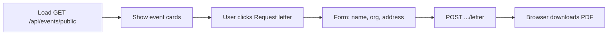

# Events / Public Invitations — Frontend Integration Guide

Simple API for listing training events on the website and letting visitors download personalized invitation letter PDFs (same attachment style as the invitation mail batches).

---

## Base URL & authentication

| Endpoint group | Auth |
|----------------|------|
| `POST/GET /api/events` | JWT required |
| `GET/POST/PUT/DELETE /api/events/trainers` | JWT required |
| `GET /api/events/public` | **No auth** |
| `POST /api/events/public/{id}/letter` | **No auth** |
| `POST /api/events/{id}/template` | JWT required |

### Standard JSON envelope

```json
{
  "status": "success" | "error",
  "message": "Human-readable message (optional)",
  "data": { }
}
```

**Exception:** `POST /api/events/public/{id}/letter` returns a raw `application/pdf` file download on success.

---

## 1. Create event (admin)

`POST /api/events`

**Auth:** Bearer JWT

**Body (JSON):**

```json
{
  "title": "June 2026 IFRS Workshop",
  "course_title": "IFRS FOR SMEs",
  "course_description": "A practical workshop covering key IFRS standards…",
  "venue": "Dar es Salaam, Tanzania",
  "start_date": "2026-06-15",
  "end_date": "2026-06-17",
  "start_time": "08:30",
  "end_time": "16:30",
  "learning_outcomes": "Understand IFRS recognition…",
  "course_fee": 150000,
  "deposit_amount": 50000,
  "reservation_deadline": "2026-06-01",
  "bank_account_name": "The African Hub",
  "bank_account_number": "0123456789",
  "bank_name": "NMB Bank",
  "trainer_ids": [1, 2],
  "is_published": false
}
```

| Field | Required |
|-------|----------|
| title | Yes |
| course_title | Yes |
| venue | Yes |
| start_date | Yes (YYYY-MM-DD) |
| end_date | Yes (must be ≥ start_date) |
| course_description | No |
| start_time / end_time | No (HH:MM or HH:MM:SS) |
| learning_outcomes | No |
| course_fee | No (TZS amount) |
| deposit_amount | No (TZS amount) |
| reservation_deadline | No (YYYY-MM-DD) |
| bank_account_name | No |
| bank_account_number | No |
| bank_name | No |
| trainer_ids | No — array of IDs from `GET /api/events/trainers` |
| is_published | No (default `false`) |

**Alternative:** `multipart/form-data` with the same fields plus optional `template` (HTML file).

Template placeholders (if uploading custom HTML): `[NAME]`, `[ADDRESS]`, `[ORGANIZATION]`. Without a template, the built-in African Hub letter is used.

**Response `201`:**

```json
{
  "status": "success",
  "message": "Event created",
  "data": {
    "id": 1,
    "title": "June 2026 IFRS Workshop",
    "course_title": "IFRS FOR SMEs",
    "course_description": "…",
    "venue": "Dar es Salaam, Tanzania",
    "start_date": "2026-06-15",
    "end_date": "2026-06-17",
    "start_time": "08:30:00",
    "end_time": "16:30:00",
    "learning_outcomes": "…",
    "payment": {
      "course_fee": 150000.0,
      "deposit_amount": 50000.0,
      "reservation_deadline": "2026-06-01",
      "bank_account_name": "The African Hub",
      "bank_account_number": "0123456789",
      "bank_name": "NMB Bank"
    },
    "trainers": [
      {
        "id": 1,
        "full_name": "Dr. Jane Mwangi",
        "designation": "Lead Facilitator",
        "bio": "20 years in public sector accounting…",
        "qualifications": "CPA, PhD",
        "photo": "https://…/jane.jpg",
        "display_order": 0
      }
    ],
    "is_published": false,
    "has_template": false,
    "invitation_template_filename": null,
    "uses_default_template": true,
    "created_by": 5,
    "updated_by": 5,
    "created_at": "2026-08-10T20:00:00",
    "updated_at": "2026-08-10T20:00:00"
  }
}
```

---

## 2. List upcoming events (admin)

`GET /api/events`

**Auth:** Bearer JWT

Returns all events where `end_date >= today`, ordered by start date ascending.

**Response `200`:**

```json
{
  "status": "success",
  "data": [
    { "id": 1, "title": "…", "course_title": "…", "start_date": "2026-06-15", "end_date": "2026-06-17", "is_published": true, "…": "…" }
  ]
}
```

Past events (ended before today) are excluded.

---

## 3. Public event list (website)

`GET /api/events/public`

**Auth:** None

Same as admin list, but:

- Only `is_published === true` events
- Only events not yet ended
- Response includes `payment` and `trainers` (with bios)
- Response omits admin fields (`is_published`, `created_by`, template paths, etc.)

**Trainers:** Manage via `/api/events/trainers` (see section 7 below).

**Response `200`:**

```json
{
  "status": "success",
  "data": [
    {
      "id": 1,
      "title": "June 2026 IFRS Workshop",
      "course_title": "IFRS FOR SMEs",
      "course_description": "…",
      "venue": "Dar es Salaam, Tanzania",
      "start_date": "2026-06-15",
      "end_date": "2026-06-17",
      "start_time": "08:30:00",
      "end_time": "16:30:00",
      "learning_outcomes": "…",
      "payment": {
        "course_fee": 150000.0,
        "deposit_amount": 50000.0,
        "reservation_deadline": "2026-06-01",
        "bank_account_name": "The African Hub",
        "bank_account_number": "0123456789",
        "bank_name": "NMB Bank"
      },
      "trainers": [
        {
          "id": 1,
          "full_name": "Dr. Jane Mwangi",
          "designation": "Lead Facilitator",
          "bio": "20 years in public sector accounting…",
          "qualifications": "CPA, PhD",
          "photo": "https://…/jane.jpg",
          "display_order": 0
        }
      ]
    }
  ]
}
```

---

## 4. Request invitation letter (public download)

`POST /api/events/public/{event_id}/letter`

**Auth:** None

**Body:**

```json
{
  "full_name": "John Doe",
  "organization": "Ministry of Finance",
  "address": "P.O. Box 123\nDodoma, Tanzania",
  "email": "john@example.com"
}
```

| Field | Required |
|-------|----------|
| full_name | Yes |
| organization | Yes |
| address | Yes |
| email | No |

**Success:** `200` with `Content-Type: application/pdf` — browser file download (same personalized PDF used in invitation mail attachments).

**Errors:**

| HTTP | When |
|------|------|
| 400 | Missing/invalid fields |
| 404 | Event not found or not published |
| 410 | Event has already ended |

---

## 5. Update event (admin)

`PUT /api/events/{event_id}`

**Auth:** Bearer JWT

Partial update — e.g. publish an event:

```json
{ "is_published": true }
```

---

## 6. Upload template (admin, optional)

`POST /api/events/{event_id}/template`

**Auth:** Bearer JWT

**Body:** `multipart/form-data`, field `template` (HTML file with `[NAME]`, `[ADDRESS]`, `[ORGANIZATION]`).

Use after create if you did not attach a template in step 1.

---

## 7. Trainers (admin)

Profiles are stored in `invitation_trainers` (shared with full invitation campaigns).

### List trainers

`GET /api/events/trainers?active_only=true`

### Create trainer

`POST /api/events/trainers`

**JSON:**
```json
{
  "full_name": "Dr. Jane Mwangi",
  "designation": "Lead Facilitator",
  "bio": "20 years in public sector accounting…",
  "qualifications": "CPA, PhD"
}
```

**Or** `multipart/form-data` with the fields above plus optional `photo` file (jpg, png, gif, webp).

**Response `201`:** returns trainer object including `id` — use in `trainer_ids` when creating/updating events.

### Get / update / deactivate

| Method | Path | Notes |
|--------|------|-------|
| `GET` | `/api/events/trainers/{id}` | Single trainer |
| `PUT` | `/api/events/trainers/{id}` | Partial update; supports photo upload |
| `DELETE` | `/api/events/trainers/{id}` | Soft delete (`is_active = false`) |

---

## Suggested website flow



---

## Admin flow

1. `POST /api/events/trainers` — create trainer profiles
2. `POST /api/events` — create event with `trainer_ids`
3. `PUT /api/events/{id}` — set `is_published: true` when ready
4. `GET /api/events` — dashboard of upcoming events

---

## Related systems

- **Full invitation campaigns** (`/api/invitations`) — batch email, trainers, invitees, scheduling
- **Invitation mail batches** (`/api/mail/invitation-batches`) — bulk email with PDF attachments

This events API is the lightweight public-facing layer for the website.
